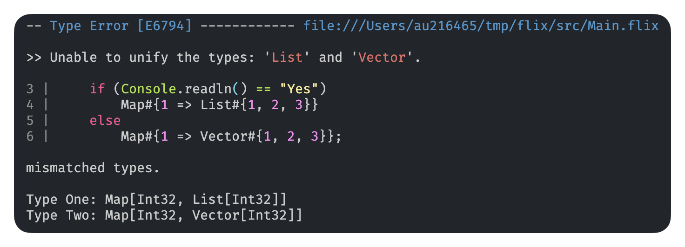
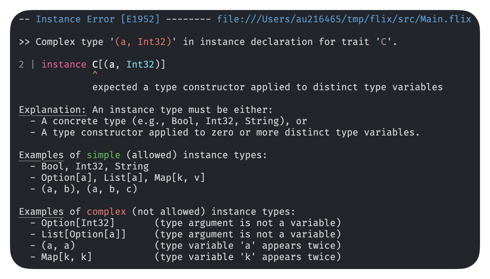

+++
title = "Improved Error Messages"
description = "TODO"
date = 2026-02-01
authors = ["Magnus Madsen"]

[taxonomies]
tags = ["language-design", "flix"]
+++

Inspired by Elm's
[Compiler Errors for Humans](https://elm-lang.org/news/compiler-errors-for-humans) and
[Compilers as Assistants](https://elm-lang.org/news/compilers-as-assistants),
we recently took the time to revisit all the error messages in the Flix compiler.

We are excited to share that error messages are now designed to guide you from
seeing an error to understanding and fixing it:
- **Syntax highlighting** makes code fragments easy to read
- **Friendly language** keeps messages clear and approachable
- **Unique error codes** let you quickly identify and look up errors
- **Detailed explanations** help you understand complex issues
- **Examples and suggestions** guide you toward a fix

Here is what you can look forward to in the next version of the Flix compiler:

# Syntax Coloring

Works for single-line 

And works for multi-line

# Straight to the point

Be brief when sufficient.

## With explanation and examples

## With explanation and suggestions

## With detailed explanation and examples

With extra details for extra complex cases

That's all for now. Hope you enjoy our new colors!