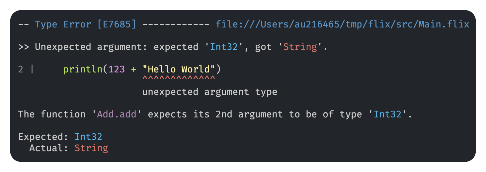
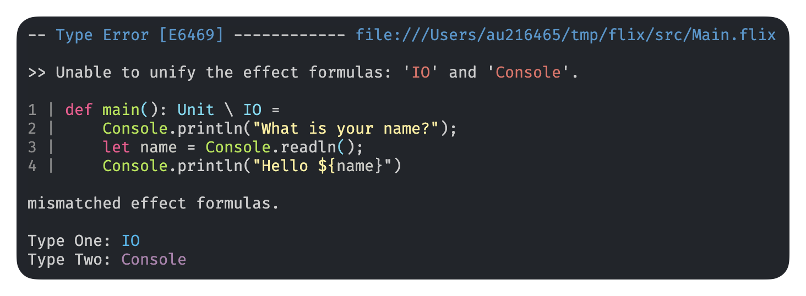
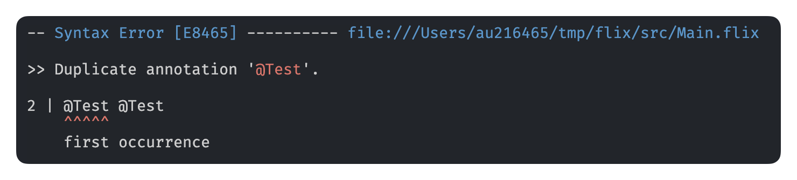
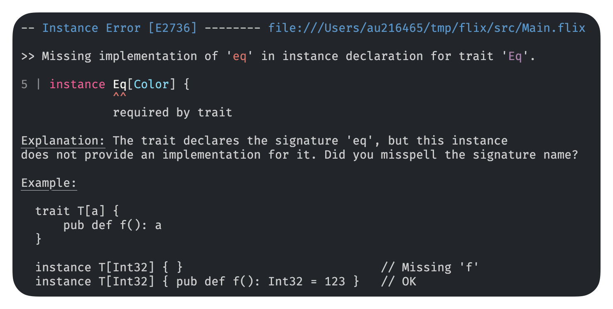
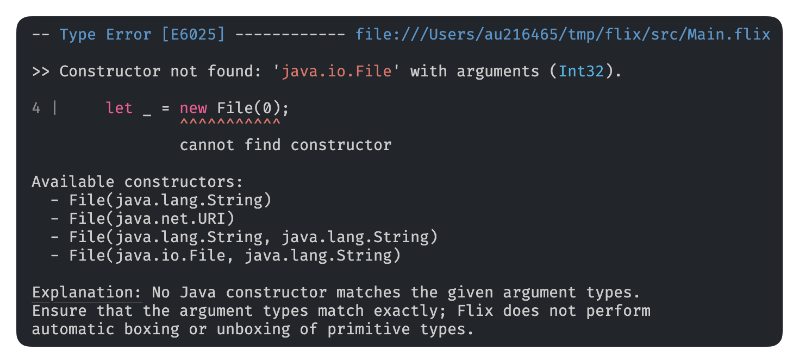

+++
title = "Improved Error Messages"
description = "TODO"
date = 2026-02-01
authors = ["Magnus Madsen"]

[taxonomies]
tags = ["language-design", "flix"]
+++

Inspired by 

https://elm-lang.org/news/compiler-errors-for-humans

https://elm-lang.org/news/compilers-as-assistants

We recently took the time go through all the Flix compiler messages.

We now have:

- Syntax highlighting!
- All errors have unique error codes.
- Short errors are just that short
- Include important details where relevant
- Difficult errors have explainations
- friendly language

Here is what you can look forward to in the next version of the Flix compiler:

# Syntax Coloring

Works for single-line 

And works for multi-line

# Straight to the point

Be brief when sufficient.

## With explanation and examples

## With explanation and suggestions

